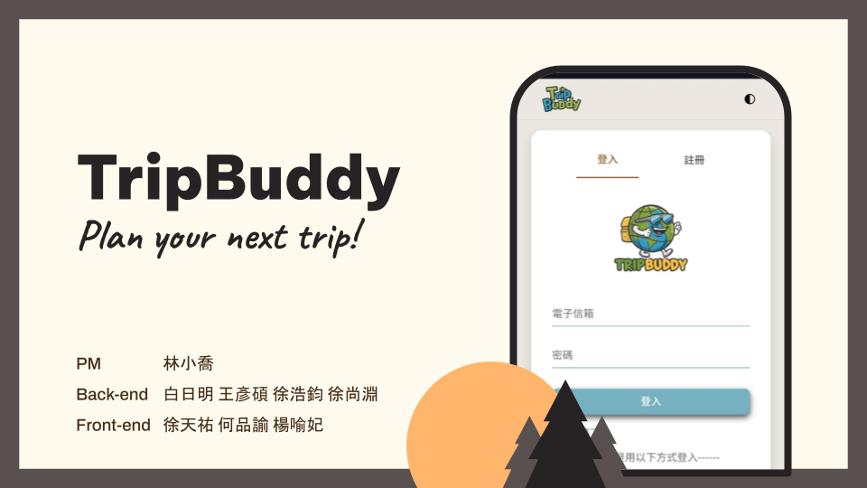

# TripBuddy

TripBuddy, as a travel planning platform, aims to address various pain points that travel enthusiasts encounter when planning their trips. It offers a comprehensive solution that allows every user to meet their needs at different stages - before departure, during the trip, and after returning - making travel easier and more enjoyable.



## Technologies Used
.png)
.png)

## System Features and Interface

.png)
.png)
.png)
.png)
.png)
.png)
.png)
.png)

## Installation

### Requirements
* Python version: 3.9 or later

* Node.js version: 20.11.1 or later

* Clone the repository
    ```
    git clone https://github.com/112-2-SDM-G4/TripBuddy.git
    ```

### Environment Variables
Create a /backend/.env file with the following content:
```
FLASK_ENV = 'LOCAL'

SECRET_KEY = # Your secret key
JWT_SECRET_KEY = # Your jwt secret key

# GCP Database setting
INSTANCE_NAME = # Your GCP instance name
DB_NAME = # Your database name
DB_USER = # Your database user
DB_PASSWORD = # Your database password
GOOGLE_MAPS_API_KEY = # Your Google Maps API key

# Mail server setting
MAIL_SERVER = "smtp.gmail.com" # Gmail server
MAIL_PORT = 587 # Gmail port
MAIL_USE_TLS = True
MAIL_DEFAULT_SENDER = ('admin', 'xxx') # Your mail service account
MAIL_USERNAME = "xxx" # Your mail service account
MAIL_PASSWORD = # Your mail service password

# gemini setting
APP_ENGINE_PROJECT_ID = # Your GCP project id
GEMINI_API_KEY = # Your Gemini API key

# Google Login setting
GOOGLE_OAUTH2_CLIENT_ID = # Your Google OAuth 2.0 client id
PROJECT_ID = # Your GCP project id
CLIENT_SECRET = # Your GCP client secret

# OpenWeather API Key
OPENWEATHER_API_KEY = # Your OpenWeather API key
```

### Back-end


1. Move to the work folder
    ```
    cd backend
    ```

2. Create a virtual environment
    ```
    python -m venv venv
    ```
3. Activate your virtual environment
    ```
    venv\Scripts\activate
    ```
3. Install dependencies
    ```
    pip install -r requirements.txt
    ```
4. Run server
    ```
    python main.py
    ```

### Front-end

1. Move to the work folder
    ```
    cd frontend
    ```

2. Install dependencies
    ```
    npm install
    ```

3. Run server
    ```
    npm start
    ```


## Contributor
- 林小喬：Product Manager
- 白日明：Back-end Developer
- 王彥碩：Back-end Developer
- 徐浩鈞：Back-end Developer
- 徐尚淵：Back-end Developer
- 徐天祐：Front-end Developer
- 何品諭：Front-end Developer
- 楊喻妃：Front-end Developer